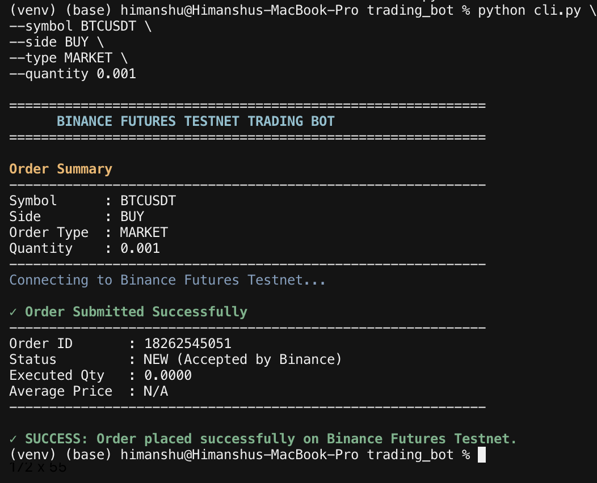
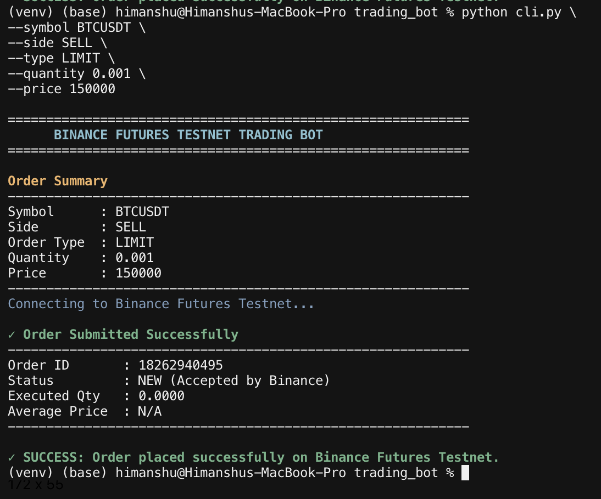
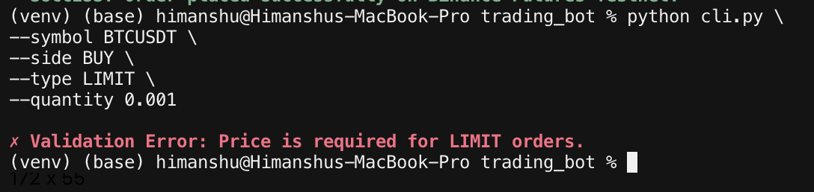

# Binance Futures Testnet Trading Bot

A CLI tool for placing **MARKET** and **LIMIT** orders on the [Binance USD-M Futures Testnet](https://testnet.binancefuture.com).

Built with [python-binance](https://python-binance.readthedocs.io/) and configured for testnet URL `https://testnet.binancefuture.com`.

## Project Structure

```
trading_bot/
├── bot/
│   ├── client.py          # Binance Futures Testnet client
│   ├── orders.py          # Market and limit order functions
│   ├── validators.py      # Input validation
│   └── logging_config.py  # Logging setup
├── cli.py                 # CLI entrypoint
├── logs/                  # Created automatically
│   └── trading_bot.log
├── .env                   # Your API credentials (not committed)
├── .env.example           # Template for API credentials
├── requirements.txt
└── README.md
```
## Screenshots

### Market Order



---

### Limit Order



---

### Validation Error




## Installation

1. Clone or download this project.

2. Create and activate a virtual environment (recommended):

```bash
python3 -m venv venv
source venv/bin/activate   # macOS / Linux
# venv\Scripts\activate  # Windows
```

3. Install dependencies:

```bash
pip install -r requirements.txt
```

## Setup

1. Create a Binance Futures Testnet account and generate API keys at [https://testnet.binancefuture.com](https://testnet.binancefuture.com).

2. Copy the example environment file and add your credentials:

```bash
cp .env.example .env
```

`.env` example:

```env
API_KEY=your_testnet_api_key_here
API_SECRET=your_testnet_api_secret_here
```

3. Never commit `.env` to version control.

## Usage

Run the bot from the project root:

```bash
python cli.py [OPTIONS]
```

### Arguments

| Argument     | Required   | Description                          |
|--------------|------------|--------------------------------------|
| `--symbol`   | Yes        | Trading pair, e.g. `BTCUSDT`         |
| `--side`     | Yes        | `BUY` or `SELL`                      |
| `--type`     | Yes        | `MARKET` or `LIMIT`                  |
| `--quantity` | Yes        | Order quantity (must be > 0)         |
| `--price`    | LIMIT only | Limit price (must be > 0)            |

### Market Order Example (BUY)

```bash
python cli.py \
  --symbol BTCUSDT \
  --side BUY \
  --type MARKET \
  --quantity 0.001
```

### Limit Order Example (SELL)

```bash
python cli.py \
  --symbol BTCUSDT \
  --side SELL \
  --type LIMIT \
  --quantity 0.001 \
  --price 65000
```

### Example Output

```
--- Request Summary ---
Symbol   : BTCUSDT
Side     : BUY
Type     : MARKET
Quantity : 0.001

--- Order Response ---
orderId     : 123456789
status      : NEW
executedQty : 0.001
avgPrice    : 64500.50

Success: Order placed successfully.
```

## Logging

Logs are written to `logs/trading_bot.log` automatically. Each entry includes:

- Timestamp
- Request details
- Response details
- Errors

API keys and secrets are redacted from log output.

## Assumptions

- **Testnet only.** The bot is configured for `https://testnet.binancefuture.com` and is not intended for live trading.
- **USD-M Futures.** Orders are placed via the USD-M Futures API (`futures_create_order`).
- **Credentials via `.env`.** `API_KEY` and `API_SECRET` are loaded from a `.env` file at the project root using `python-dotenv`. Keys are never hardcoded.
- **Limit order time-in-force.** LIMIT orders use `GTC` (Good Till Cancel).
- **Quantity and price format.** Values are passed as strings to match Binance API expectations; validation ensures they are positive numbers.
- **Network access required.** The bot needs an internet connection to reach the Binance Testnet API.
- **Valid symbol.** The symbol must exist and be tradable on the Futures Testnet (e.g. `BTCUSDT`).

## Bonus Feature

Implemented **Enhanced CLI UX**.

### Improvements

- Added colored terminal output using `colorama`.
- Displayed a clean and professional order summary.
- Improved success and error messages for better readability.
- Enhanced order response formatting.
- Console output is now clean, while detailed API requests, responses, and errors are logged to `logs/trading_bot.log`.

## Error Handling

The bot handles the following without crashing:

| Error type              | Behavior                                      |
|-------------------------|-----------------------------------------------|
| Invalid CLI arguments   | argparse help message, exit code `2`          |
| Validation errors       | Descriptive failure message, exit code `1`    |
| Missing credentials     | Descriptive failure message, exit code `1`    |
| Binance API errors      | API code and message printed, exit code `1`   |
| Network timeouts        | User-friendly message, exit code `1`          |
| Connection errors       | User-friendly message, exit code `1`          |
| Unexpected exceptions   | Generic failure message, exit code `1`          |
